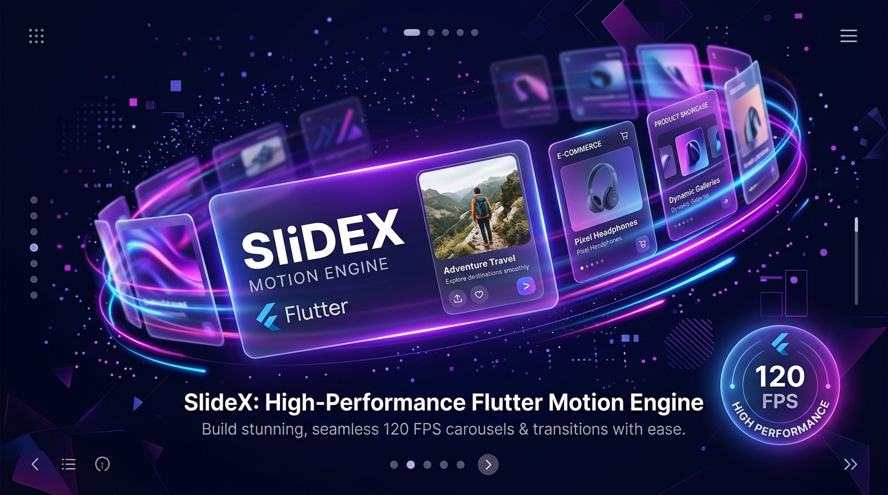
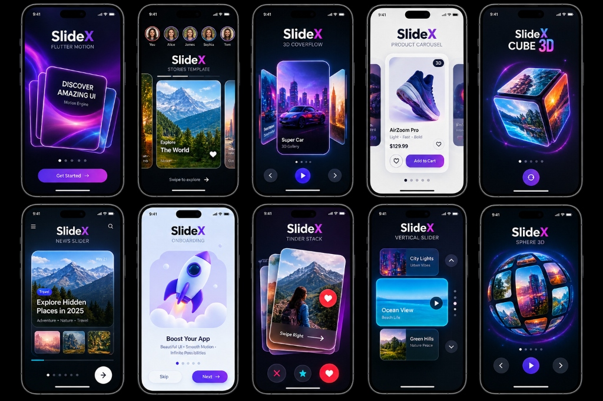
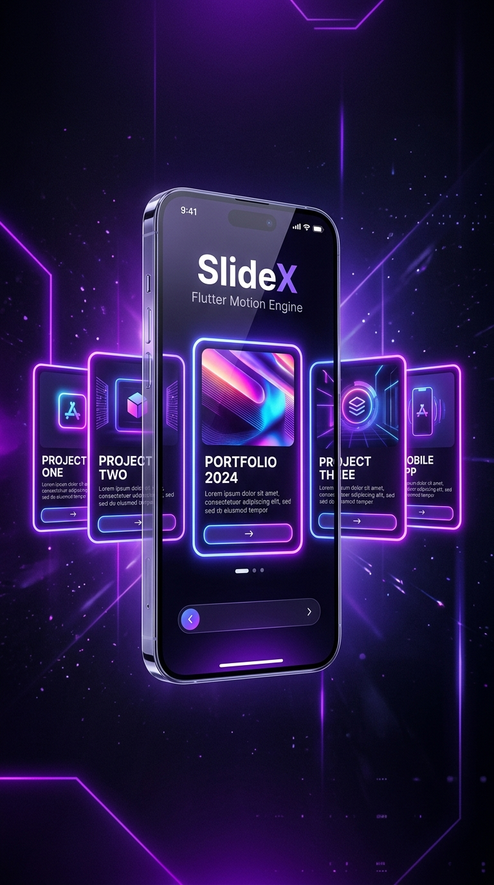
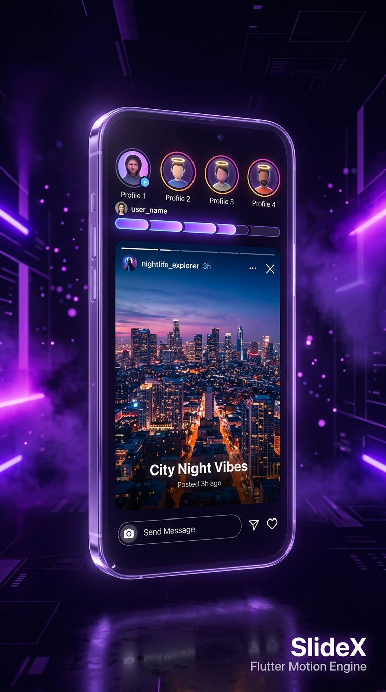
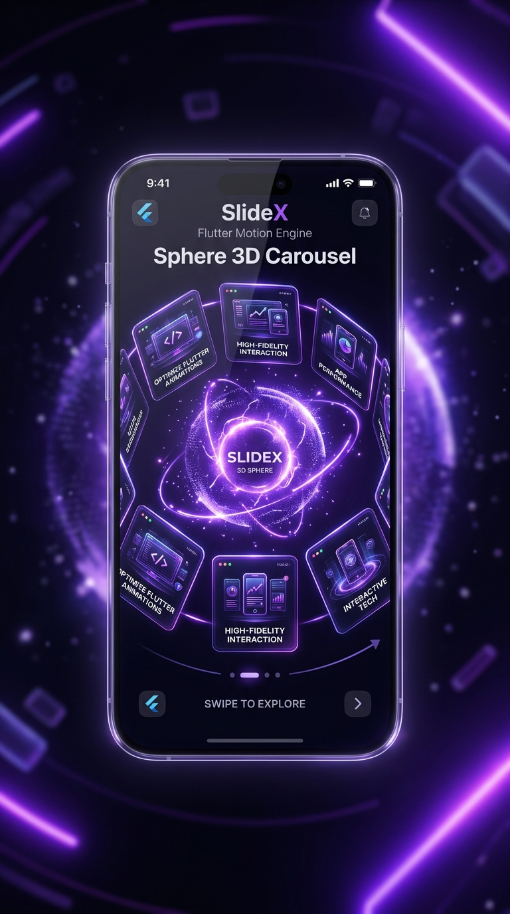
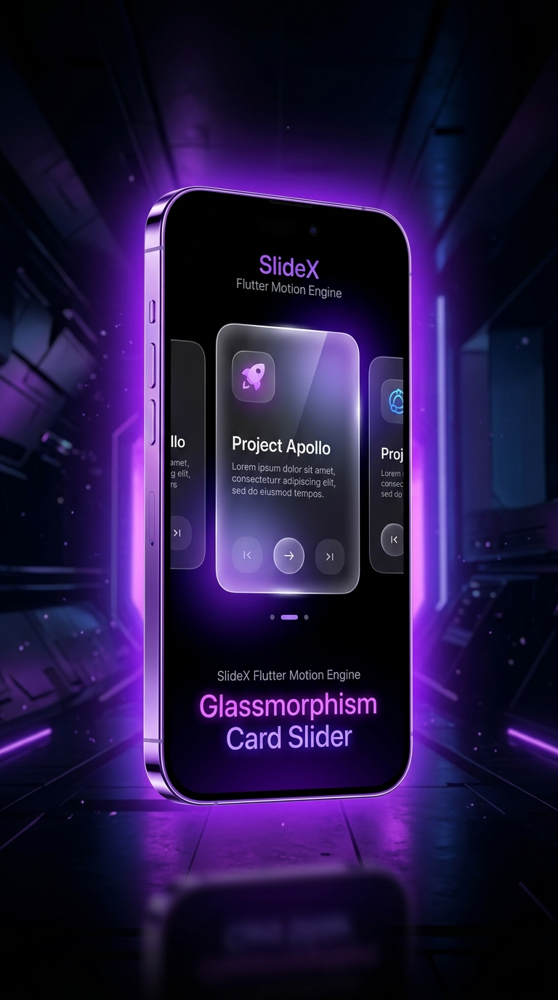

# SlideX 🚀

<p align="center">
  <a href="https://pub.dev/packages/slidex"></a>
  <a href="https://imCoderAditya.github.io/SlideX/"></a>
  <a href="https://flutter.dev"></a>
  <a href="https://flutter.dev"></a>
  <a href="https://opensource.org/licenses/MIT"></a>
</p>

<p align="center">
  <a href="https://imCoderAditya.github.io/SlideX/">
    
  </a>
</p>


---

## 🌟 What is SlideX?

**SlideX** is the premier, high-performance **120 FPS Motion Engine & Carousel Framework** for Flutter.

Instead of installing 10 different packages for sliders, story viewers, product galleries, card swipers, and onboarding pages — **SlideX combines everything into one unified, zero-dependency package** with 100% granular color and style control!

> 👉 Check out the live interactive documentation at <a href="https://imcoderaditya.github.io/SlideX/doc/" target="_blank"><strong>SlideX Docs</strong></a>!
---

<p align="center">
  <a href="https://imCoderAditya.github.io/SlideX/">
    
  </a>
</p>

## 🔥 Features at a Glance

- ⚡ **120 FPS Hardware Acceleration**: Zero-lag spring physics with GPU `RepaintBoundary` layer isolation and offstage pre-rendering.
- 🎴 **Tinder-Style Card Swiper (`SlideX.cardSwipe`)**: Real-time gesture rotation, LIKE/NOPE badges, programmatic `SlideXCardSwiperController`, and instant rewind/undo.
- 🚀 **App Onboarding Slider (`SlideXOnboarding`)**: Built-in 3D illustration cards, Skip, Next, and Get Started CTA buttons with active glowing shadows.
- ↕️ **Vertical Axis Carousel (`SlideX.vertical`)**: Native vertical scroll with top/bottom arrow chevrons (`▲`, `▼`) and vertical indicator dots bar.
- 📖 **Instagram / Snapchat Story Viewer (`SlideX.story`)**: Timer progress bars, tap right/left navigation, and long-press to pause.
- 🛍️ **E-Commerce Gallery & 360° Spinner (`SlideX.gallery` & `SlideX.product360`)**: Auto-scrolling thumbnail strip, full-screen lightbox zoom, and 360° product frame rotation.
- 🖼️ **Universal Slide Container (`SlideXItem`)**: Pre-built factory constructors for Images (`SlideXItem.image`), Videos (`SlideXItem.video`), and Custom Child Widgets (`SlideXItem.child`).
- 🎭 **27+ 2D & 3D Transitions**: Coverflow 3D, Cube 3D, Sphere 3D, Wheel 3D, Cylinder 3D, Tunnel 3D, Helix 3D, Stack 3D, Parallax, Zoom, Scale, Blur, Liquid, Curtain, Morph, and Elastic.
- 🖱️ **Web & Desktop Mouse Support**: Native mouse wheel scrolling, trackpad gestures, and `pauseOnHover` auto-play control.

---

## 🚀 Installation

Add `slidex` to your `pubspec.yaml`:

```yaml
dependencies:
  slidex: ^1.0.0
```

Import it in your Dart file:

```dart
import 'package:slidex/slidex.dart';
```

---

## 💡 Quickstart Code Snippets (Copy & Paste Ready)

### 1. 3D Coverflow Carousel

```dart
SlideX(
  effect: const CoverflowEffect(depth: 120.0, rotateAngle: 0.45),
  indicatorType: SlideXIndicatorType.expandingDot,
  indicatorActiveColor: const Color(0xFFEC4899),
  config: const SlideXConfig(
    autoPlay: true,
    viewportFraction: 0.85,
    pauseOnHover: true,
  ),
  items: [
    CardWidget1(),
    CardWidget2(),
    CardWidget3(),
  ],
)
```

---

### 2. Tinder-Style Card Swiper with Programmatic Controller

```dart
final controller = SlideXCardSwiperController();

// Widget
SlideX.cardSwipe(
  controller: controller,
  likeBadgeText: 'LIKE',
  nopeBadgeText: 'NOPE',
  onSwipeLeft: (index) => print('Swiped NOPE on card $index'),
  onSwipeRight: (index) => print('Swiped LIKE on card $index'),
  cards: [
    UserCard1(),
    UserCard2(),
    UserCard3(),
  ],
);

// Programmatic Control Buttons:
// controller.swipeLeft();
// controller.swipeRight();
// controller.rewind();
```

---

### 3. App Onboarding Slider

```dart
SlideXOnboarding(
  activeColor: const Color(0xFF6366F1),
  skipText: 'Skip',
  nextText: 'Next →',
  finishText: 'Get Started 🚀',
  pages: const [
    SlideXOnboardingItem(
      image: Icon(Icons.rocket_launch, size: 100, color: Color(0xFF6366F1)),
      title: 'Boost Your App',
      description: 'Beautiful UI • Smooth Motion • Infinite Possibilities',
    ),
    SlideXOnboardingItem(
      image: Icon(Icons.bolt, size: 100, color: Color(0xFFEC4899)),
      title: '120 FPS Motion Engine',
      description: 'Tuned spring physics with zero drop frames',
    ),
  ],
  onFinished: () => print('Onboarding Finished!'),
)
```

---

### 4. Vertical Axis Carousel Slider

```dart
SlideX.vertical(
  height: 440,
  viewportFraction: 0.85,
  indicatorActiveColor: const Color(0xFF6366F1),
  upControlColor: const Color(0xFF6366F1),
  downControlColor: const Color(0xFFEC4899),
  items: [
    CityCard(),
    OceanCard(),
    ForestCard(),
  ],
)
```

---

### 5. Image & Video Slide Items (`SlideXItem`)

```dart
SlideX(
  effect: const ZoomEffect(),
  items: [
    // Video Slide Item
    SlideXItem.video(
      VideoPlayerCoverWidget(),
      title: 'Cosmic Voyage (4K Trailer)',
      durationText: '02:45',
      badgeText: 'VIDEO 4K',
      onPlayTap: () => print('Play video'),
    ),

    // Image Slide Item
    SlideXItem.image(
      const NetworkImage('https://images.unsplash.com/photo-1518709268805-4e9042af9f23'),
      title: 'Neon Cyberpunk City',
      subtitle: 'Sci-Fi • 6K Wallpaper',
      badgeText: 'FEATURED',
    ),

    // Custom Child Widget Slide Item
    SlideXItem.child(
      CustomPromoBanner(),
    ),
  ],
)
```

---

### 6. Instagram / Snapchat Story Viewer

```dart
SlideX.story(
  items: [
    SlideXStoryItem(
      duration: Duration(seconds: 5),
      content: StoryPage1(),
    ),
    SlideXStoryItem(
      duration: Duration(seconds: 5),
      content: StoryPage2(),
    ),
  ],
  onCompleted: () => print('All stories completed!'),
)
```

---

### 7. Product Media Gallery with Lightbox Zoom

```dart
SlideX.gallery(
  thumbnailHeight: 76,
  activeBorderColor: const Color(0xFF6366F1),
  enableFullscreenZoom: true,
  showBadge: true,
  items: [
    ProductMedia1(),
    ProductMedia2(),
    ProductMedia3(),
  ],
)
```

---

### 8. 360-Degree Interactive Product Viewer

```dart
SlideX.product360(
  height: 320,
  autoRotate: false,
  imageList: [
    AssetImage('assets/frame_01.png'),
    AssetImage('assets/frame_02.png'),
    // ... 36 product angle frames
  ],
)
```

---

## 📸 Showcase Template Renders

<table>
  <tr>
    <td width="50%" align="center">
      <b>Template 01: CoverFlow 3D Carousel</b><br/><br/>
      
    </td>
    <td width="50%" align="center">
      <b>Template 02: Cube 3D Slider</b><br/><br/>
      
    </td>
  </tr>
  <tr>
    <td width="50%" align="center">
      <b>Template 03: Netflix Banner Carousel</b><br/><br/>
      
    </td>
    <td width="50%" align="center">
      <b>Template 04: Instagram Story Viewer</b><br/><br/>
      
    </td>
  </tr>
  <tr>
    <td width="50%" align="center">
      <b>Template 05: Tinder Card Stack</b><br/><br/>
      
    </td>
    <td width="50%" align="center">
      <b>Template 06: E-Commerce Product Gallery</b><br/><br/>
      
    </td>
  </tr>
  <tr>
    <td width="50%" align="center">
      <b>Template 07: Sphere 3D Carousel</b><br/><br/>
      
    </td>
    <td width="50%" align="center">
      <b>Template 08: Glassmorphism Card Slider</b><br/><br/>
      
    </td>
  </tr>
</table>

---

## ⚙️ Granular Configuration Reference

| Property | Default Value | Description |
|---|---|---|
| `scrollDirection` | `SlideXAxis.horizontal` | Carousel scroll axis (`horizontal` / `vertical`) |
| `viewportFraction` | `1.0` | Viewport area occupied per slide (0.0 to 1.0) |
| `autoPlay` | `false` | Enable automatic page slideshow |
| `autoPlayInterval` | `3 seconds` | Duration interval between auto slides |
| `pauseOnHover` | `true` | Pause slideshow on desktop mouse hover |
| `clipBehavior` | `Clip.none` | Container clip behavior package-wide |
| `loopMode` | `SlideXLoopMode.infinite` | Infinite looping carousel mode |
| `perspective` | `0.002` | 3D perspective depth factor |
| `indicatorType` | `expandingDot` | Indicator style (`expandingDot`, `dot`, `number`, `progressLine`, `none`) |
| `indicatorActiveColor` | `Color(0xFF6366F1)` | Active indicator dot color |
| `indicatorInactiveColor` | `Color(0x4DFFFFFF)` | Inactive indicator dot color |

---

## 📄 License

MIT License. Free for commercial and personal projects.
