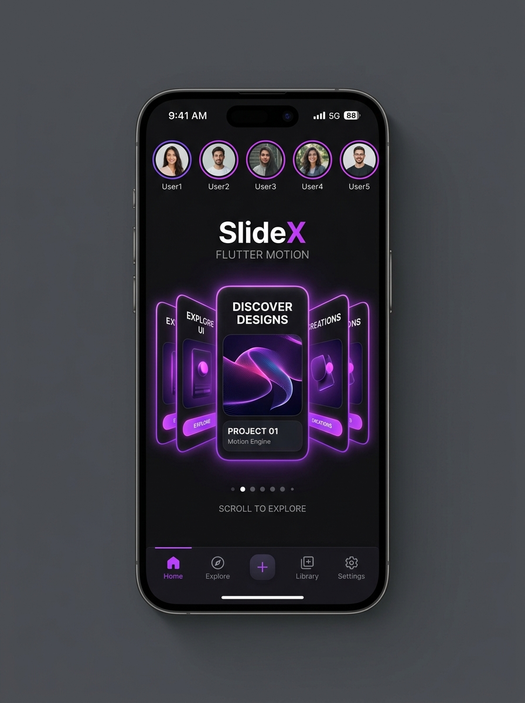

# SlideX 🚀

<p align="center">
  
</p>

<p align="center">
  
</p>

<p align="center">
  
</p>

<p align="center">
  <a href="https://pub.dev/packages/slidex"></a>
  <a href="https://flutter.dev"></a>
  <a href="https://opensource.org/licenses/MIT"></a>
</p>

**SlideX** is not just a carousel package. It is a complete, high-performance **120 FPS Motion Engine & Carousel Framework** for Flutter.

Combines Sliders, Swipers, Carousels, Tinder-style Card Swiper, Instagram Story Viewer, Product Media Gallery, 360-Degree Product Spinners, Enterprise Image Sliders, and 27+ 2D/3D Animations into one unified, zero-dependency package.

---

## 📸 Template Showcase Gallery

<p align="center">
  
</p>

<table>
  <tr>
    <td width="50%" align="center">
      <b>Template 01: CoverFlow 3D Carousel</b><br/><br/>
      
    </td>
    <td width="50%" align="center">
      <b>Template 02: Cube 3D Slider</b><br/><br/>
      
    </td>
  </tr>
  <tr>
    <td width="50%" align="center">
      <b>Template 03: Netflix Banner Carousel</b><br/><br/>
      
    </td>
    <td width="50%" align="center">
      <b>Template 04: Instagram Story Viewer</b><br/><br/>
      
    </td>
  </tr>
  <tr>
    <td width="50%" align="center">
      <b>Template 05: Tinder Card Stack</b><br/><br/>
      
    </td>
    <td width="50%" align="center">
      <b>Template 06: E-Commerce Product Gallery</b><br/><br/>
      
    </td>
  </tr>
  <tr>
    <td width="50%" align="center">
      <b>Template 07: Sphere 3D Carousel</b><br/><br/>
      
    </td>
    <td width="50%" align="center">
      <b>Template 08: Glassmorphism Card Slider</b><br/><br/>
      
    </td>
  </tr>
</table>

---

## 🌟 Key Features

- **⚡ 120 FPS Ultra Smooth Physics**: Zero-drop frame transitions with tuned spring physics.
- **🎴 Tinder-Style Card Swiper (`SlideX.cardSwipe`)**: Interactive left/right card swipe stack with rotation matrix, LIKE/NOPE badges, programmatic `SlideXCardSwiperController`, and instant rewind/undo.
- **🔄 360° Interactive Product Spinner (`SlideX.product360`)**: Horizontal touch/mouse drag 360-degree product frame spinner.
- **🖼️ Enterprise Image Slider (`SlideX.imageSlider`)**: Full-width image slider with captions, gradient overlays, badges, auto-play, and lightbox zoom.
- **📖 Instagram/Snapchat Story Viewer (`SlideX.story`)**: Progress bar indicators, tap next/previous, and long-press to pause.
- **🛍️ Product Media Gallery (`SlideX.gallery`)**: Auto-scrolling thumbnail strip, active border glow, and full-screen pinch-to-zoom modal.
- **🎭 27+ 2D & 3D Perspective Effects**: Coverflow 3D, Cube 3D, Sphere 3D, Wheel 3D, Cylinder 3D, Tunnel 3D, Helix 3D, Stack 3D, Parallax, Zoom, Scale, Blur, Liquid, Curtain, Morph, and more.
- **🎨 100+ Template Presets (`SlideXTemplates`)**: Pre-built configurations for E-Commerce, News, Travel, Movies, Tech, and Onboarding.
- **🖱️ Web & Desktop Mouse Support**: Native mouse wheel, drag physics, and `pauseOnHover` auto-play control.
- **♿ Fully Accessible & Keyboard Navigation**: Arrow key controls and screen reader accessibility support out of the box.

---

## 🚀 Getting Started

Add `slidex` to your `pubspec.yaml`:

```yaml
dependencies:
  slidex: ^1.0.0
```

Import it in your Dart code:

```dart
import 'package:slidex/slidex.dart';
```

---

## 💡 Usage Examples

### 1. Classic 3D Coverflow Carousel

```dart
SlideX(
  effect: const CoverflowEffect(depth: 120.0, rotateAngle: 0.45),
  indicatorType: SlideXIndicatorType.expandingDot,
  config: const SlideXConfig(
    autoPlay: true,
    viewportFraction: 0.85,
    pauseOnHover: true,
  ),
  items: [
    CardWidget1(),
    CardWidget2(),
    CardWidget3(),
  ],
)
```

---

### 2. Tinder-Style Card Swiper with Programmatic Controller

```dart
final controller = SlideXCardSwiperController();

// Widget
SlideX.cardSwipe(
  controller: controller,
  onSwipeLeft: (index) => print('Swiped NOPE on card $index'),
  onSwipeRight: (index) => print('Swiped LIKE on card $index'),
  cards: [
    UserCard1(),
    UserCard2(),
    UserCard3(),
  ],
);

// Programmatic Actions:
// controller.swipeLeft();
// controller.swipeRight();
// controller.rewind();
```

---

### 3. Enterprise Image Slider

```dart
SlideX.imageSlider(
  height: 240,
  autoPlay: true,
  effect: const ParallaxEffect(),
  images: [
    SlideXImageData.network(
      'https://images.unsplash.com/photo-1518709268805-4e9042af9f23',
      title: 'Cosmic Horizon',
      subtitle: 'Sci-Fi • 4K Wallpaper',
      badge: 'FEATURED',
    ),
    SlideXImageData.network(
      'https://images.unsplash.com/photo-1507525428034-b723cf961d3e',
      title: 'Emerald Beach',
      subtitle: 'Nature • 8K Ultra HD',
    ),
  ],
)
```

---

### 4. 360-Degree Interactive Product Viewer

```dart
SlideX.product360(
  height: 320,
  imageList: [
    AssetImage('assets/frame_01.png'),
    AssetImage('assets/frame_02.png'),
    AssetImage('assets/frame_03.png'),
    // ... 36 product angle frames
  ],
)
```

---

### 5. Instagram / Snapchat Story Viewer

```dart
SlideX.story(
  items: [
    SlideXStoryItem(
      duration: Duration(seconds: 5),
      content: StoryContentWidget1(),
    ),
    SlideXStoryItem(
      duration: Duration(seconds: 5),
      content: StoryContentWidget2(),
    ),
  ],
  onCompleted: () => print('All stories completed!'),
)
```

---

### 6. Product Media Gallery

```dart
SlideX.gallery(
  thumbnailHeight: 76,
  effect: const ScaleEffect(),
  items: [
    ProductMedia1(),
    ProductMedia2(),
    ProductMedia3(),
  ],
)
```

---

## ⚙️ Configuration & Customization Options

| Property | Default Value | Description |
|---|---|---|
| `scrollDirection` | `SlideXAxis.horizontal` | Axis direction (`horizontal` / `vertical`) |
| `viewportFraction` | `1.0` | Viewport size occupied per slide (0.0 to 1.0) |
| `autoPlay` | `false` | Enable automatic page slideshow |
| `autoPlayInterval` | `3 seconds` | Interval duration between auto slides |
| `pauseOnHover` | `true` | Pause slideshow on desktop mouse hover |
| `clipBehavior` | `Clip.none` | Container clip behavior |
| `loopMode` | `SlideXLoopMode.infinite` | Infinite looping mode |
| `perspective` | `0.002` | 3D perspective depth factor |

---

## 📄 License

MIT License. Free for commercial and personal projects.
